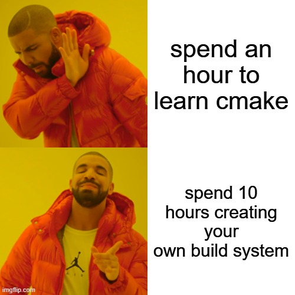

# muuk

I don't like CMake very much but I do like cargo a lot, so I created my own cargo-like build system.



Another relevant comic (all credit to xkcd):


## features

- Big three compiler support (GCC, Clang, MSVC)
- Big three platform support (Linux, MacOS, Windows)
- Task runner using `muuk run <script>`. Works pretty much like `npm run <script>`
- Clean command
- C++ Meta builder built on top of Ninja
- C++20 Experimental Module Support
- Able to define Platform, Compiler & Profile Specific Flags
- All flags are automatically applied to dependencies

# setup

`muuk` requires the following programs to be installed and available on the PATH:

* `git`
* `ninja` (you probably have this since I believe its bundled with most CMake distributions.)
* `wget`

Thats it!

# guide

A typical `muuk.toml` file looks like the one contained within this repo [muuk.toml](https://github.com/evanwporter/muuk/blob/20f4c740d704398914c65f4549eb513da97ef326/muuk.toml)

Lets break it apart:

## **`[package]`**

This section defines the package's **metadata** (name and version).

```toml
[package]
name = "muuk"
version = "1.0.0"
edition = "20"
```

- `name` → The name of the project.
- `version` → The project version.
- `edition` → Doesn't do anything (yet)

---

## **`[clean]`**

Specify glob patterns for what gets cleaned.

```toml
[clean]
patterns = ["*.obj", "*.lib", "*.pdb"]
```

This will be changed in the future to clean up the build artifacts. Will likley call

## **`[library]`**

The `[library]` section defines **libraries** that can be compiled separately and linked into other targets.

### Example:

```toml
[library]
include = ["include"]
sources = ["src/library.cpp"]
cflags = ["-Wall", "-Wextra"]
dependencies = { boost = { version = "1.75.0", muuk_path = "../boost" } }
```

### **Library Keys**

- `include` → A list of include directories.
- `sources` → A list of source files for the library.
- `cflags` → Compiler flags specific to this library.
- `dependencies` → Defines dependencies required by this library.

**Dependency Format:**

```toml
dependencies = { dep_name = { version = "X.Y.Z", git = "https://example.com/author/repo.git", muuk_path = "path/to/dep" } }
```

## **`[build]`**

This section defines **build targets**, which can be executables or other build artifacts.

### Example:

```toml
[build.my_executable]
profiles = ["release", "debug"]
sources = ["src/main.cpp"]
dependencies = ["my_library"]
```

### **Build Target Keys**

- `sources` → Source files used to build the target.
- `dependencies` → Libraries this build target depends on.

Note that this build artifact will include the compiler specific rules.

## **`[profile]`**

Profiles define **build configurations**, such as `debug` and `release`, but they can be whatever.

### Example:

```toml
[profile.base]
cflags = ["-std:20"]

[profile.debug]
inherits = ["base"]
cflags = ["-g", "-O0"]
lflags = []

[profile.release]
inherits = "base"
cflags = ["-O2"]
lflags = []
```

### **Profile Keys**

- `cflags` → Compiler flags for the profile.
- `lflags` → Linker flags for the profile.

## **`[platform]`**

The `[platform]` section defines platform-specific flags. Acceptable platforms are `windows`, `linux`, `apple`.

### Example:

```toml
[platform.windows]
cflags = ["-DWIN32"]
lflags = ["-lkernel32"]

[platform.linux]
cflags = ["-DLINUX"]
lflags = ["-pthread"]
```

### **Platform Keys**

- `cflags` → Compiler flags for this platform.
- `lflags` → Linker flags for this platform.

## **`[compiler]`**

This section defines compiler-specific flags. Acceptable compilers are `gcc`, `msvc` or `clang`

### Example:

```toml
[compiler.g++]
cflags = ["-std=c++20"]
lflags = ["-lstdc++"]
```

### **Compiler Keys**

- `cflags` → Compiler flags specific to this compiler.
- `lflags` → Linker flags specific to this compiler.

## **`[scripts]`**

This section defines build-related scripts, such as running an executable. This works like `npm run <script>`. Also muuk will add the name of your built executable so you can easily run it.

### Example:

```toml
[scripts]
do = "something.exe"
```

- `run` → Defines how to run the built executable.

# todo

Little Extra Stuff I have Planned So I don't Forget

## full compat with other meta-builders

```
[library.external]
type = "cmake",
path = "../some_cmake_lib",
args = ["-DBUILD_SHARED_LIBS=ON"]
outputs = ["build/cmake_some_cmake_lib/libmylib.a"]
```

Output will define the library to link against.
