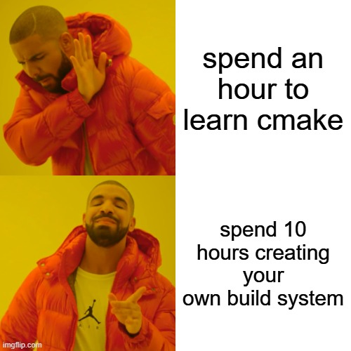

# muuk

I don't understand how to use cmake and I liked cargo a lot, so I created my own cargo-like build system.

Another relevant comic:

## Features

- Task runner using `muuk run <script>`. Works pretty much like `npm run <script>`
- Clean command
- C++ Meta builder built on top of Ninja
- C++20 Experimental Module Support
- Rar brute force Cracker
- Able to define Platform, Compiler & Profile Specific Flags
- All flags are automatically applied to dependencies
